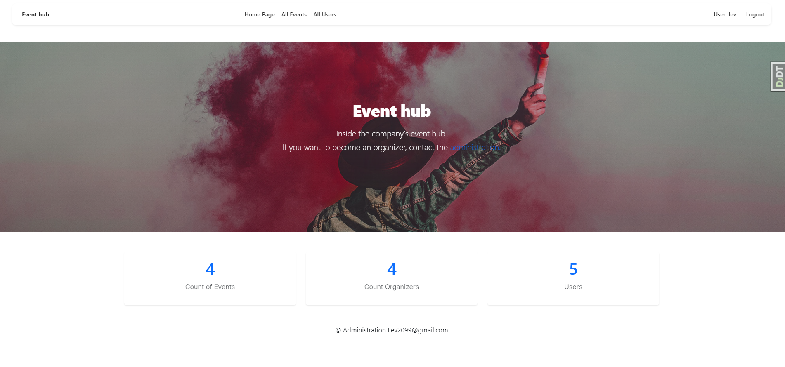
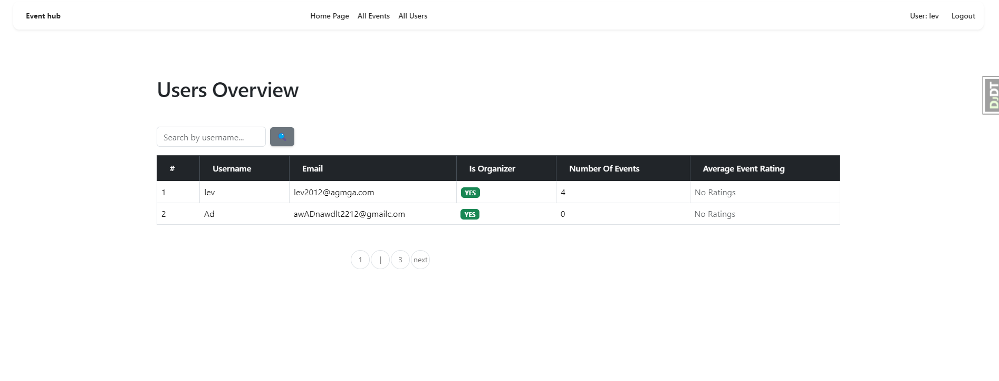
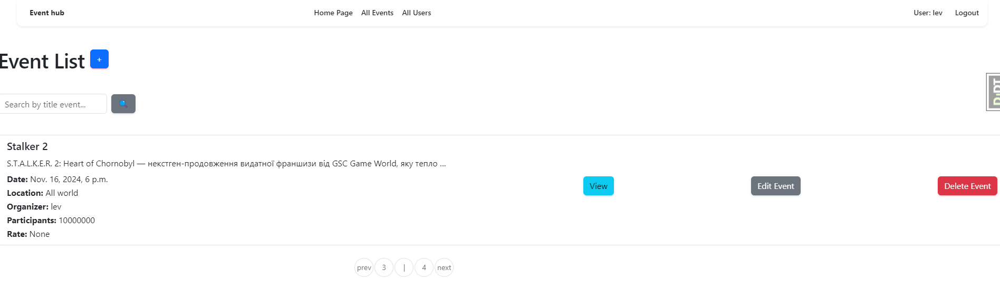

# Event Hub
URL https://event-hub-jrvd.onrender.com

login: lev

password: lev 


Event Hub is a Django-based web application designed to manage events and participants. It supports organizing events, user management, feedback, and ratings for events. The project is currently in the **Alpha 1.0** stage of development.

## Table of Contents
- [Features](#features)
- [Installation](#installation)
- [Usage](#usage)
- [Models](#models)
- [Views](#views)
- [Templates](#templates)
- [Contributing](#contributing)
- [License](#license)

## Features
- User authentication and management
- Event creation and management
- Participant registration and confirmation for events
- Feedback system for events, including ratings and comments
- Search functionality for events and users
- Detailed views of events and users with pagination

## Installation

To run this project locally, you'll need to follow these steps:

1. **Clone the repository:**
    ```sh
    git clone https://github.com/Lev2098/event-hub
    cd event_hub
    ```

2. **Create a virtual environment:**
    ```sh
    python -m venv venv
    source venv/bin/activate  # On Windows use `venv\Scripts\activate`
    ```

3. **Install dependencies:**
    ```sh
    pip install -r requirements.txt
    ```

4. **Apply migrations:**
    ```sh
    python manage.py migrate
    ```

5. **Create a superuser:**
    ```sh
    python manage.py createsuperuser
    ```

6. **Run the development server:**
    ```sh
    python manage.py runserver
    ```

Then, open your browser and go to `http://127.0.0.1:8000/` to see the project in action.

## Usage

1. **Homepage:**
    - Overview of the total number of events, organizers, and users.
    - [http://127.0.0.1:8000/](http://127.0.0.1:8000/)

2. **User Management:**
    - Lists all users along with their details and allows searching by username.
    - [http://127.0.0.1:8000/users/](http://127.0.0.1:8000/users/)

3. **Event Management:**
    - Lists all events with details and allows searching by title.
    - [http://127.0.0.1:8000/events/](http://127.0.0.1:8000/events/)
    - Only organizers can create, update, and delete events.

## Models

- **User:** Inherits from Django’s AbstractUser. Users can be organizers. 
- **Event:** Contains event information, including title, description, date, location, maximum participants, and organizer.
- **Participant:** Represents the many-to-many relationship between Users and Events.
- **Feedback:** Allows users to provide ratings and comments for events.

## Views

- **index:** Overview of the total number of events, organizers, and users.
- **UserListView:** Lists users with their details and supports searching by username.
- **EventListView:** Lists events with details and supports searching by title.
- **EventDetailView:** Detailed view of a single event.
- **EventCreateView, EventUpdateView, EventDeleteView:** CRUD operations for events, restricted to organizers.

## Templates

- **index.html:** Homepage template.
- **user_list.html:** User list view template.
- **event_list.html:** Event list view template.
- **event_detail.html:** Detailed event view template.
- **access_denied.html:** Displays the access denied message.

## Contributing

Contributions are welcome! Please read the (coming soon) for details on our code of conduct, and the process for submitting pull requests.

## License

This project is licensed under the MIT License - see the (coming soon) file for details.
=======
